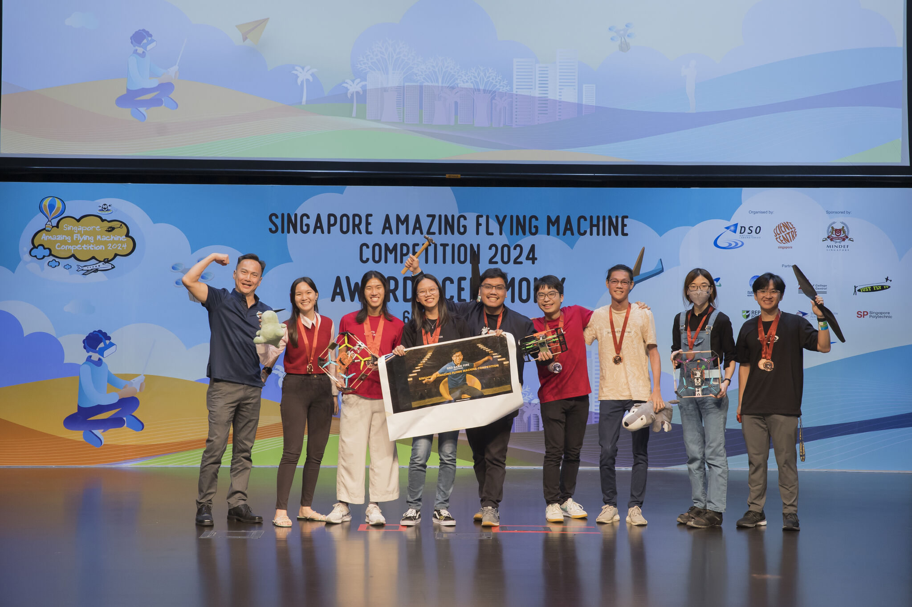
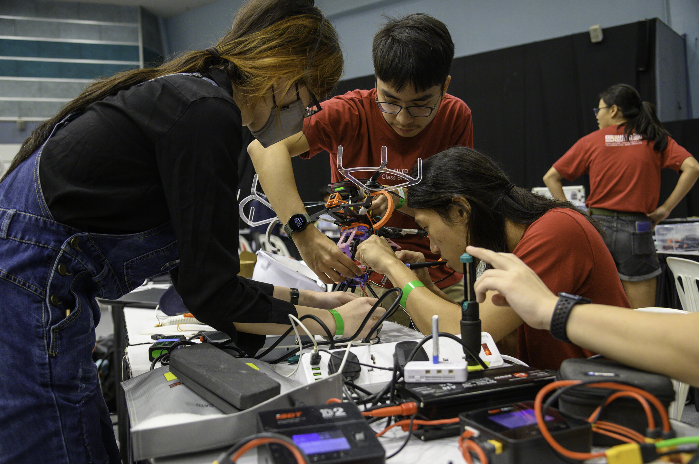

# Build. Design. Fly.

Multirotor Society (MRS) is a Student Organisation at the Singapore University of Technology and Design (SUTD).

### About Us

<!--  -->

#### Who are we?

We are a club of students who are are keen on developing and building drones for various applications. Although our main focus is on building and flying Multi-Rotors of varying levels of autonomy, our members are generally interested in remote controlled (RC) vehicles such as drones, cars and boats and will ocassionally dabble in these fields as well.
