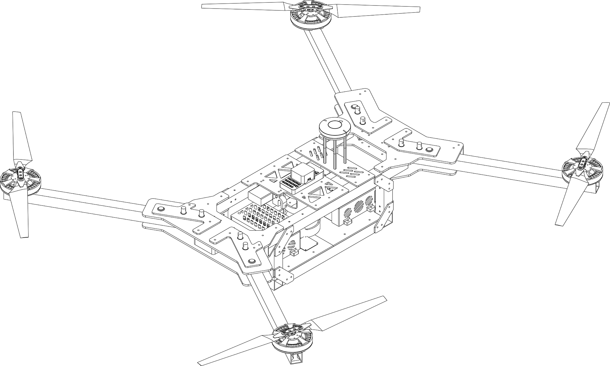

<figure style="padding: 25px">
    
</figure>

<h1 style="text-align:center">Multi Rotor Club, SUTD</h1>

## BUILD.DESIGN.FLY
Multi Rotor Club is 5th Row Club at SUTD (Singapore University of Technology and Design)

[Get to know us more :fontawesome-solid-arrow-down:](#about-us){: .md-button}
[Our Club Documentation :fontawesome-solid-book-open:](#){: .md-button .md-button--primary}

## About Us

We are a club of students who are are keen on developing and building drones for various applications. Although our main focus is on building and flying Multi-Rotors of varying levels of autonomy, our members are generally interested in remote controlled (RC) vehicles such as drones, cars and boats and will ocassionally dabble in these fields as well.

<iframe src="https://drive.google.com/file/d/1Mb1uhvAureCqd0QTz6fW4g7oXfUseBE4/preview" frameborder="0" width="850" height="461"></iframe>